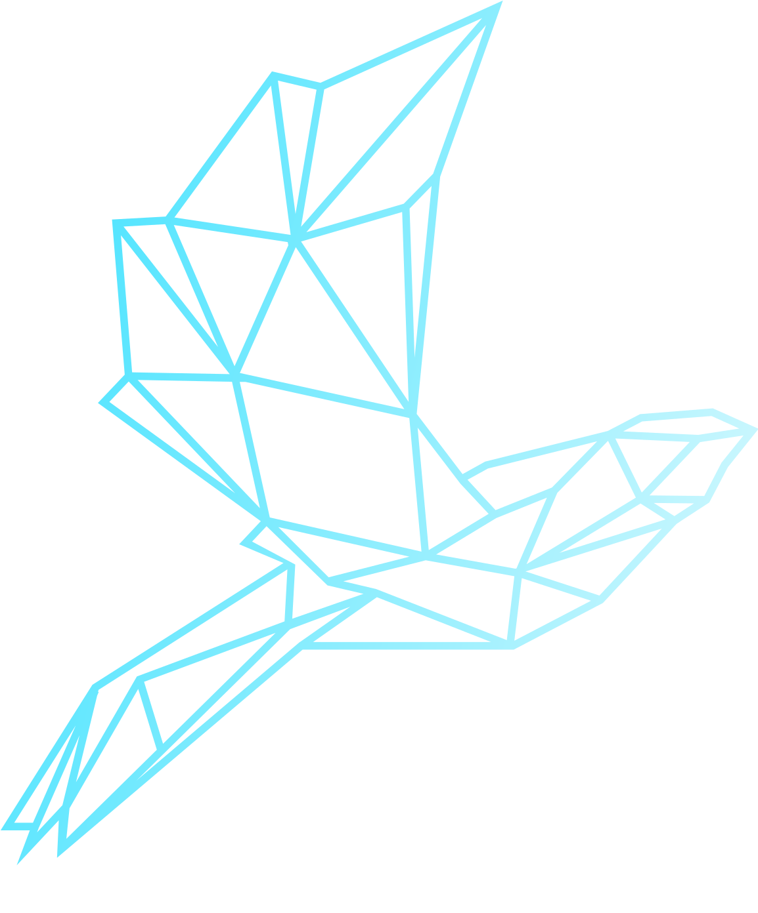

<h2 align="center">Zernikalos Engine</h2>

<div align="center">


  <p align="center">
    Zernikalos is a lightweight and fast game engine developed entirely in Kotlin for Android, iOS, and Web. Built with a simple yet powerful API, it facilitates efficient game development, ensuring a seamless experience across platforms.
  </p>
</div>

## 🚀 Quick Start

### Building the Project

For building the project across all platforms:
```bash
./gradlew build
```

### Platform-Specific Builds

**Android:**
```bash
./gradlew assembleAndroidRelease
```

**iOS:**
```bash
./gradlew assembleZernikalosXCFramework
```
*Note: Requires Xcode installed on macOS*

**Web:**
```bash
./gradlew jsBrowserWebpack
```

## 📦 Release Process

### Creating a New Version

To upgrade to version X.Y.Z and publish:

```bash
# 1. Set new version
./gradlew setVersion -PnewVersion=X.Y.Z

# 2. Generate version files
./gradlew updateVersion

# 3. Create release commit and tag
./gradlew releaseCommit

# 4. Push to trigger automated build and publish
git push origin main --tags
```

The system automatically:
- Builds all platforms
- Publishes to GitHub Packages (Maven + NPM)
- Creates GitHub Release


## 🛠️ Development

### Prerequisites
- **Gradle**: Latest version
- **Kotlin**: Multiplatform support
- **Android**: Android SDK (for Android builds)
- **iOS**: Xcode (for iOS builds)
- **Web**: Node.js (for web builds)

### Available Gradle Tasks
See [gradle/libs.versions.toml](gradle/libs.versions.toml) for all available tasks and dependencies.

## 🤝 Contributing

We welcome contributions! Please see our [Contributing Guidelines](CONTRIBUTING.md) for details.

### Contributors

- **Aarón Negrín** - Lead Developer & Creator

## 📄 License

This project is licensed under the Mozilla Public License 2.0 (MPL 2.0). See the [LICENSE](LICENSE) file for details.

## 🔗 Links

- **Website**: [zernikalos.dev](https://zernikalos.dev)
- **GitHub**: [Zernikalos/Zernikalos](https://github.com/Zernikalos/Zernikalos)
- **Packages**: 
  - Maven: `dev.zernikalos:zernikalos`
  - NPM: `@zernikalos/zernikalos`