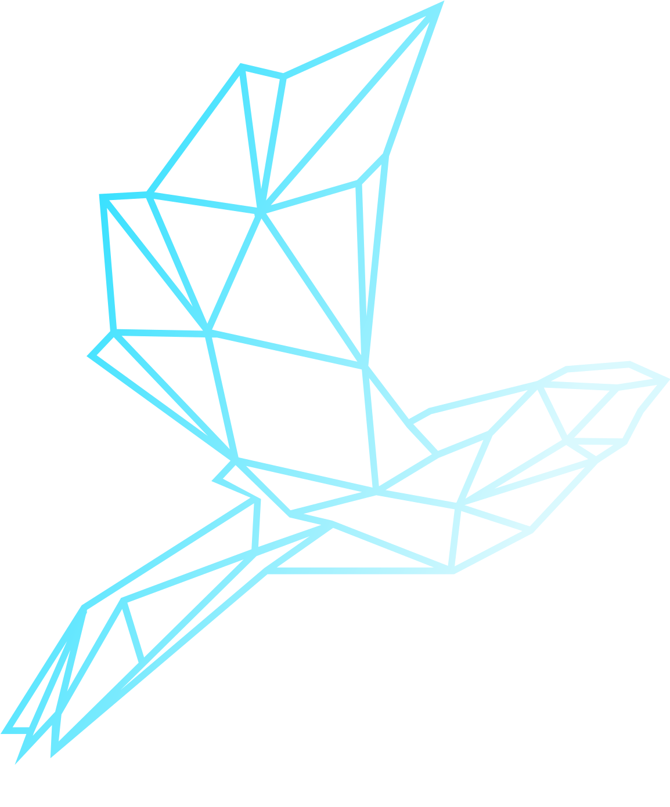

<h2 align="center">Zernikalos Engine</h2>

<div align="center">
  

  <p align="center">
    Kotlin-first 3D engine for Android, iOS, and Web.
    <br />
    Build one rendering and gameplay core, then ship it across platforms with native surfaces and a shared scene model.
  </p>

  <p align="center">
    <a href="https://zernikalos.dev/docs/quick-start"><strong>Quick Start</strong></a>
    ·
    <a href="https://zernikalos.dev/demos"><strong>Live Demos</strong></a>
    ·
    <a href="https://zernikalos.dev/api"><strong>API Reference</strong></a>
  </p>
</div>

## What Is Zernikalos?

Zernikalos is a Kotlin Multiplatform 3D engine for real-time graphics and cross-platform experimentation. It provides a unified API that compiles to native Android, Apple, and Web targets from a single codebase.

The engine is currently best suited to prototyping and experimentation. See the [live demos](https://zernikalos.dev/demos) and [documentation](https://zernikalos.dev/docs) for the current workflow and capabilities.

## Features

- **Kotlin Multiplatform** — One codebase, native performance on Android, iOS, macOS, and Web
- **Scene graph** — Hierarchical composition of cameras, lights, models, and transforms
- **Asset pipeline** — Import from standard formats (GLB, glTF, FBX, OBJ) and bundle for runtime
- **Skeletal animation** — Playback and control of rigged character animations
- **Platform backends** — OpenGL (Android), Metal (Apple), WebGPU/WebGL (Web)

## Getting Started

### Documentation

- [Quick Start](https://zernikalos.dev/docs/quick-start)
- [Documentation](https://zernikalos.dev/docs)
- [API Reference](https://zernikalos.dev/api)

```bash
./gradlew build
```

## Repository Structure

| Directory | Contents |
|-----------|----------|
| `engine/` | Kotlin Multiplatform engine source |
| `docs/` | API reference and architecture documentation |

For detailed architecture docs, see [`docs/architecture/`](docs/architecture/).

## Development

### Prerequisites

- JDK 17+
- Android SDK (for Android builds)
- Xcode and CocoaPods (for Apple targets)
- Node.js (for Web/JS tooling)

### Published packages

Packages are published to GitHub Packages in this repository:

- **Maven:** `dev.zernikalos:zernikalos` — [View on GitHub Packages](https://github.com/aarongarcia/zernikalos/packages)
- **npm:** `@zernikalos/zernikalos` — [View on GitHub Packages](https://github.com/aarongarcia/zernikalos/packages)

## Contributing

Contributions are welcome. See [CONTRIBUTING.md](CONTRIBUTING.md) to get started.

## License

This project is licensed under the Mozilla Public License 2.0. See [LICENSE](LICENSE) for details.
