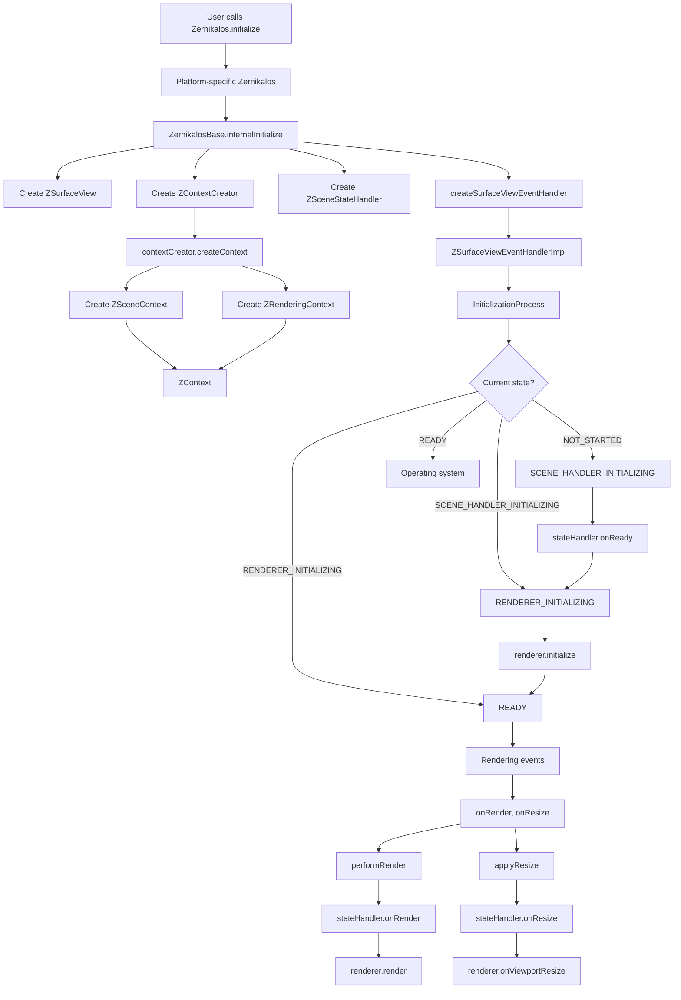
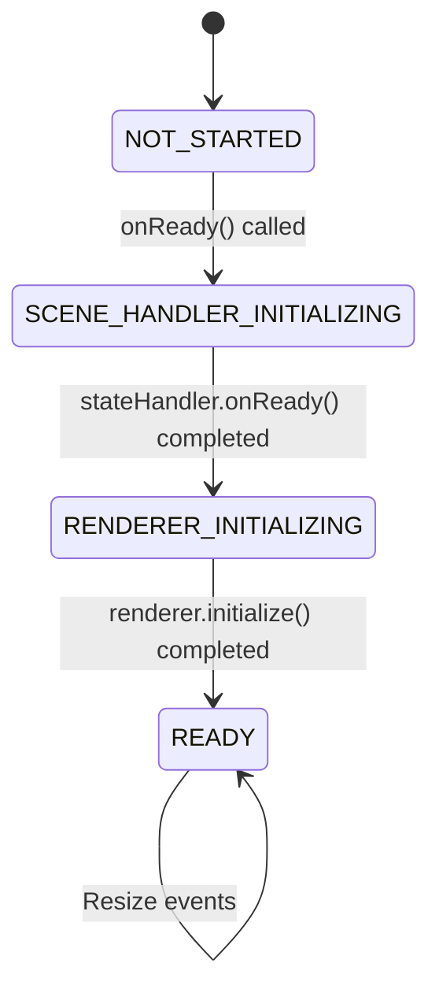
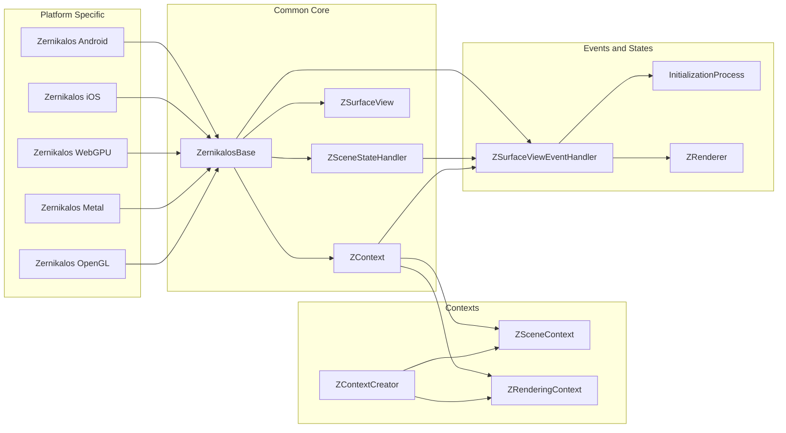
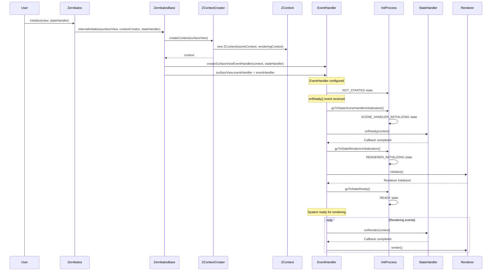
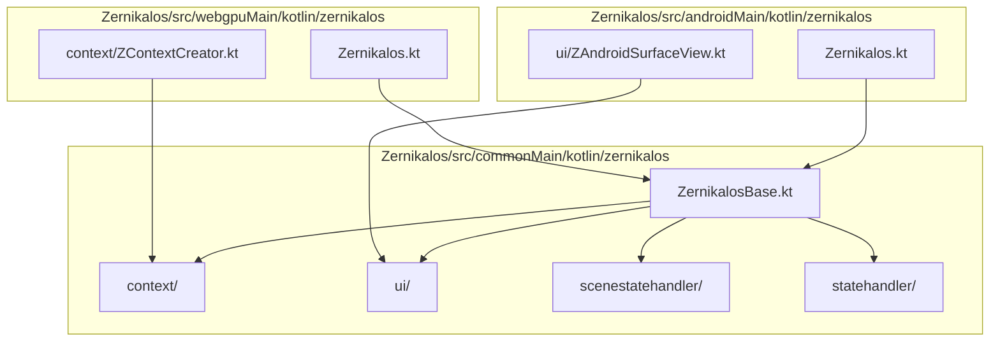

# Zernikalos Initialization Flow Diagram

## Main Diagram (Mermaid)

## Initialization States Diagram

## Components and Dependencies Diagram

## Detailed Event Flow

## File Structure and Responsibilities

## Platform Entry Points

| Platform | Responsibility |
|----------|----------------|
| Android | Adapts `GLSurfaceView` to `ZSurfaceView` |
| iOS | Adapts native iOS view |
| WebGPU | Configures WebGPU context |
| Metal | Configures Metal context |
| OpenGL | Configures OpenGL context |

## Architecture Summary

Zernikalos architecture follows a **Template Method** pattern where:

1. **ZernikalosBase** defines the initialization skeleton
2. **Platform-specific implementations** provide concrete details
3. **Asynchronous event system** handles gradual initialization
4. **State machine** controls initialization flow
5. **Separate contexts** for scene and rendering allow flexibility

This architecture allows the engine to work on multiple platforms while maintaining a common core, but the complexity of the initialization flow can make debugging and maintenance difficult.
